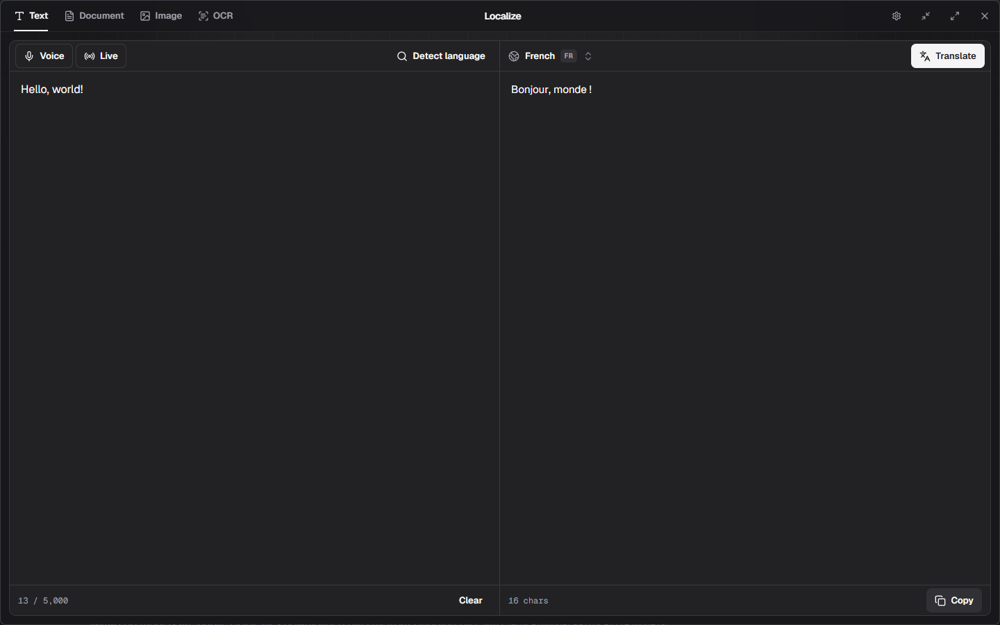

# Localize

Localize is a private-first desktop workspace for translating text, documents,
and images with models that run on your own computer. It is built for the
moments when copying sensitive text into a web translator is not an option—or
when you simply want to choose the model that does the work.



## What it does

- Translates text, detects its language, and lets you replace a translated word
  or phrase with contextual alternatives without translating the whole text
  again.
- Extracts and translates text from PDF, EPUB, MOBI, DOCX, XLSX, and PPTX
  files. Scanned pages can fall back to local vision OCR.
- Translates text in images and extracts text through a separate OCR workspace.
- Supports Ollama as well as a Localize-managed llama.cpp server, so models can
  come from Ollama or public Hugging Face GGUF repositories.
- Adds local speech input through whisper.cpp: record from a selected
  microphone, transcribe an audio file, or insert live speech into the editor.
- Keeps translation content out of a history database. Temporary input files,
  rendered pages, and recordings are cleaned up after the active operation.

Localize is a Windows 10/11 x64 application. Native runtimes and model weights
are deliberately not shipped with the installer: choose exactly what you need
from Settings after the app is installed.

## Download

Download the latest Windows x64 executable or NSIS installer from the
[GitHub Releases page](https://github.com/FlameInTheDark/localize-app/releases).
After launching Localize, choose and install the inference runtimes and models
you want in Settings; they are not included with the application download.

## Build from source

To develop Localize yourself, install Go 1.26+, Bun, and a Windows WebView2
runtime. Then clone and start the app:

```powershell
git clone https://github.com/FlameInTheDark/localize-app.git
cd localize-app
bun --cwd frontend install
go run github.com/wailsapp/wails/v2/cmd/wails@v2.12.0 dev
```

### Choose an inference provider

For the quickest start, install and run [Ollama](https://ollama.com/), then
open **Settings → Models** in Localize and pull a translation model such as
`translategemma:latest`. Pull a vision-capable model separately if you want to
use image translation or OCR.

If you prefer GGUF models, open **Settings → Runtime** to install a selected
llama.cpp CPU or CUDA version. In **Settings → Models**, choose where GGUF
files should live, find a public Hugging Face model, download it, and assign it
as the translation model. Vision models also need their compatible `mmproj`
projection file.

You can switch between Ollama and llama.cpp at any time. Localize starts only
the llama.cpp processes it owns, listens on loopback, and stops them when the
app closes.

### Recommended models

These are the models currently used during Localize development. They make a
good local-first starting point and are not included with the app download.

| Use | Ollama | llama.cpp / whisper.cpp |
| --- | --- | --- |
| Text translation | `translategemma:latest` (3.3 GB) | [`translategemma-4b-it.Q8_0.gguf`](https://huggingface.co/mradermacher/translategemma-4b-it-GGUF) (3.8 GiB) |
| Image and document OCR | `glm-ocr:latest` (2.2 GB) | [`GLM-OCR-Q8_0.gguf`](https://huggingface.co/ggml-org/GLM-OCR-GGUF) with its matching `mmproj` file (about 1.3 GiB together) |
| Speech input | — | `ggml-large-v3-turbo.bin` (1.5 GiB) |

For llama.cpp vision/OCR, always download the model and its matching `mmproj`
projection file. If your hardware needs a smaller model, choose another public
GGUF or Whisper model in Settings and assign it to the same role.

### Speech and documents

Voice input is optional. Install a chosen whisper.cpp version under
**Settings → Runtime**, then select an official Whisper model and microphone in
**Settings → Speech**. The **Voice** button records or accepts WAV, MP3, FLAC,
and OGG files; **Live** inserts completed speech into the current text editor.

Document translation needs MuPDF. Pick and install an official MuPDF Windows
version from **Settings → Runtime** before translating documents. Localize
returns aligned source and translated text; it does not rebuild the original
PDF or Office layout.

## Privacy and downloads

Configured inference stays local: Ollama is contacted on its local endpoint,
and llama.cpp runs on `127.0.0.1`. Localize only uses the network when you ask
it to download a runtime or model, or when you choose a provider that uses one.
Runtime and model downloads show progress, speed, and remaining time, are
resumable where upstream supports it, and are published atomically after
validation.

## Development

Run the checks used by the Windows verification workflow:

```powershell
go vet ./...
go test -race ./...
bun --cwd frontend run check
bun --cwd frontend run build
```

Build a production executable with:

```powershell
go run github.com/wailsapp/wails/v2/cmd/wails@v2.12.0 build
```

To build the NSIS installer instead:

```powershell
.\scripts\build-installer.ps1
```

## Releases

Pull requests and pushes to `main` run the Windows frontend and Go checks.
Conventional commits on `main` create semantic releases: `feat:` creates a
minor release, `fix:` creates a patch release, and a breaking change creates a
major release. The release workflow attaches both the Windows executable and
the NSIS installer. Runtimes and models remain user-installed rather than
release assets.

## Project notes

The architecture is documented in [docs/ARCHITECTURE.md](docs/ARCHITECTURE.md).
See [LICENSE](LICENSE) for Localize's license and
[licenses/THIRD_PARTY_NOTICES.md](licenses/THIRD_PARTY_NOTICES.md) for the
licenses and sources of third-party components.
