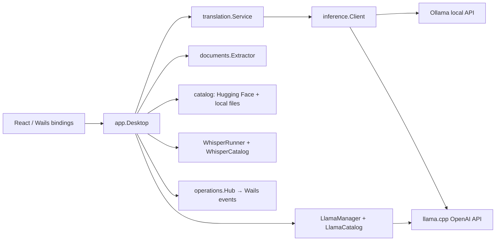

# Architecture

## Boundary design

`internal/domain` owns request/result types and settings values. Interfaces in
`internal/inference` make Ollama and llama.cpp replaceable. Wails is confined to
`internal/app`, which binds methods, opens native dialogs, and forwards typed
progress updates to the renderer. This keeps workflows testable with in-memory
or HTTP test doubles and prevents frontend code from starting processes or
calling provider endpoints directly.

## Lifecycle and privacy

- `LlamaManager` launches only children created by Localize and stops them on
  settings changes and application shutdown.
- It binds llama.cpp to loopback and starts with one selected model assignment.
- `WhisperRunner` starts only short-lived local `whisper-cli` children, writes
  recorded WAV data into a private temporary operation directory, and removes
  that directory before returning a transcript.
- Settings and managed model files persist under LocalAppData. Translation text,
  document content, temporary rendered pages, and image bytes are not persisted.
- The only default network routes are configured local providers and explicit
  model downloads/searches initiated from Settings.

## Runtime and release invariants

- `LlamaCatalog` reads public Windows x64 releases directly from the official
  ggml-org GitHub API. It downloads release archives with resumption and live
  transfer progress, verifies the release-provided SHA-256 digest, validates
  archive paths, then atomically installs them under LocalAppData.
- The managed runtime root is intentionally outside the executable directory,
  so `wails dev` and installed builds resolve exactly the same user-selected
  runtime version.
- llama.cpp, whisper.cpp, and MuPDF are all installed explicitly by the user
  at runtime; the NSIS installer carries none of their binaries.
- `MuPDFCatalog` reads stable official Artifex GitHub releases that contain a
  Windows archive. It supports version selection, resume, progress, expected
  byte-count validation, archive/path validation, and atomic publication under
  LocalAppData.
